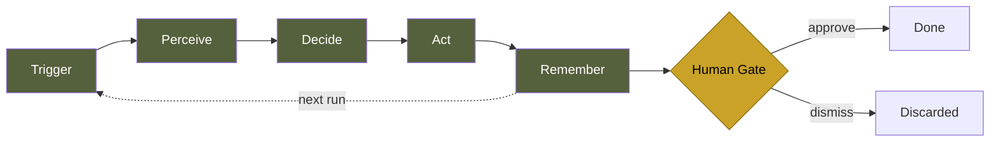
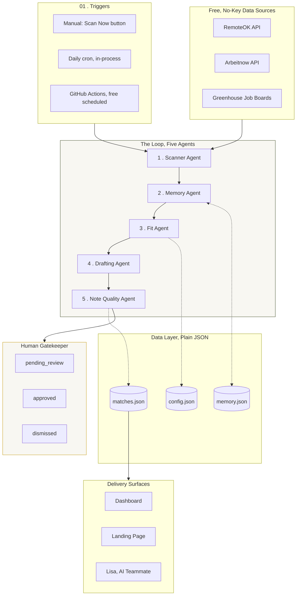
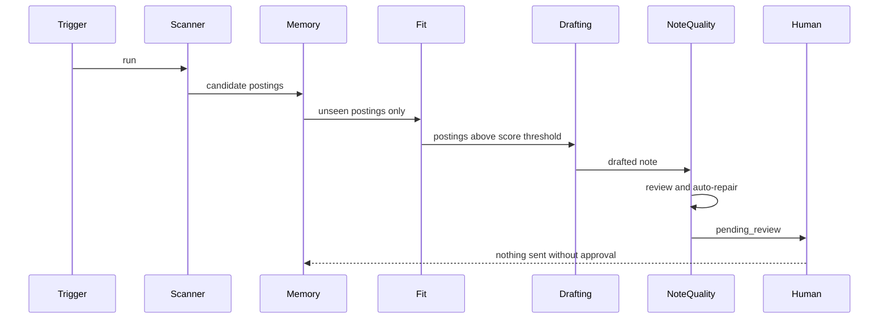

<div align="center">

# 🔁 The Watch
### A Loop Engineering System for Autonomous Job Discovery

**An AI agent architecture that watches, thinks, and waits for you — instead of the other way around.**

[]()
[]()
[]()
[]()
[]()
[]()

[Overview](#-overview) • [Loop Engineering](#-what-is-loop-engineering) • [Architecture](#-architecture) • [The Six Agents](#-the-six-agents) • [Meet Lisa](#-meet-lisa--the-embedded-ai-teammate) • [Tech Stack](#-tech-stack) • [Quality & Testing](#-quality-security--testing) • [Getting Started](#-getting-started) • [Deployment](#-deployment)

</div>

---

## 📖 Overview

**The Watch** is a self-operating job-discovery system. It scans real job boards on a schedule, remembers everything it has already shown you, scores every posting against your actual skill profile using two independent signals, drafts a tailored outreach note, and then — deliberately — **stops and waits for you.**

It costs **$0** to run. Every API, every scheduling mechanism, and every piece of infrastructure behind it is free.

This isn't a script. It's a small, cooperating system of agents — the practical demonstration of a pattern called **Loop Engineering**, and this README documents both the pattern and the working system built on it.

> **The problem this solves:** manually refreshing job boards is repetitive, low-value work that a person keeps doing anyway because automating it "sounds complicated." It isn't. It's five small, well-defined jobs chained together, with one rule that never bends.

---

## 🧠 What is Loop Engineering?

Loop Engineering is the discipline of turning a repetitive, human-in-the-loop task into an autonomous **trigger → perceive → decide → act → remember → gate** cycle, without losing the judgment of the human who used to do it manually.

It is *not* a claim that this is brand-new computer science. The underlying pattern (agents observing, deciding, and acting in a loop) has existed in various forms since 2023: ReAct, AutoGPT, and now frameworks like LangGraph. What's genuinely new is that models and tooling have become reliable enough for loops like this to run unattended *without* spiraling into hallucinated nonsense, which is what makes the pattern practically useful now, not just theoretically interesting.

Every real loop-engineered system has four parts:



**The one rule that makes this safe to run unattended:** the loop never performs an irreversible action on its own. It watches, filters, and drafts, a human always presses the final button. This isn't a limitation bolted on afterward; it's enforced directly in the code, not just described in this document.

---

## 🏗️ Architecture



*(Full high-resolution version: [`architecture.svg`](./architecture.svg))*

---

## 🤖 The Six Agents

Each agent is a small, single-purpose function, not six separate model calls. Five run automatically on every scan; the sixth runs on demand.

| # | Agent | File | What it actually does |
|---|-------|------|------------------------|
| 1 | **Scanner** | `loop/agent.js` | Pulls live postings from RemoteOK, Arbeitnow, and any Greenhouse boards you configure, in parallel, with independent failure handling per source |
| 2 | **Memory** | `loop/agent.js` | Keeps a capped set of every job ID ever seen, so nothing is ever shown twice |
| 3 | **Fit** | `loop/fitAgent.js` | Scores every posting two ways: keyword matching **and** local TF-IDF cosine similarity, a real statistical signal, not a keyword hack |
| 4 | **Drafting** | `loop/agent.js` | Writes a tailored outreach note per match, built from your real profile |
| 5 | **Note Quality** | `loop/noteQualityAgent.js` | Reviews its own draft against a concrete rubric and mechanically repairs it before a human ever sees it |
| 6 | **Profile Builder** | `loop/profileBuilderAgent.js` + `loop/resumeFileParser.js` | Extracts real must-have/nice-to-have skills from an uploaded **PDF, DOCX, or TXT** resume, fully transparent, shows exact term counts |



---

## 🎙️ Meet Lisa — the Embedded AI Teammate

Every screen in this project has an **"Ask Lisa"** button, a live, conversational AI teammate you can talk to (voice or text) who actually knows this project's real architecture, not a generic chatbot.

**What I engineered for this feature, specifically:**

- **A curated knowledge base** — a structured 14-page reference document covering the loop architecture, every agent's real behavior, the actual bugs found and fixed during development, and honest answers to both technical and non-technical questions, so Lisa's answers are grounded in what this system *actually* does, not a generic LLM guess.
- **A hand-written system prompt and persona**, calibrated so answers match the depth of the question (plain-English for a recruiter, technical detail for an engineer), and explicitly instructed to say "I don't know" rather than invent an answer.
- **Secure embedding**, with a scoped Content-Security-Policy `frame-src` directive so the live conversational widget can load without weakening the rest of the app's security posture.
- **A production-grade UI wrapper** — a full-viewport modal with a fade/scale-in animation, click-outside-to-close, Escape-to-close, lazy iframe loading (so it costs nothing for visitors who never open it), and an honest fallback notice if the connection stalls.

Lisa is built on a third-party real-time conversational AI platform, wired into this project's own knowledge base and interface, the same way a production application integrates any specialized external service (payments, email, video) rather than reinventing it from scratch. The engineering here is the **integration**: the knowledge curation, the prompt design, the security configuration, and the UX around it.

---

## 🛠️ Tech Stack

<div align="center">

| Layer | Choice | Why |
|---|---|---|
| Runtime | **Node.js 18+** | Built-in `fetch`, zero extra HTTP dependency |
| Server | **Express** | Thin, well-understood, easy to secure |
| Scheduling (local) | **node-cron** | Simple in-process daily trigger |
| Scheduling (free, serverless) | **GitHub Actions** | Runs the loop daily on GitHub's own machines, $0 cost |
| Data Sources | **RemoteOK, Arbeitnow, Greenhouse** | Free, public, zero API keys |
| Storage | **Plain JSON files** | No database to host, no ORM, nothing to manage |
| PDF Parsing | **poppler-utils (`pdftotext`)** | Battle-tested C library beats a fragile pure-JS parser |
| DOCX Parsing | **mammoth** | Small, focused, no heavy dependency chain |
| Security | **helmet, tiered auth + rate limiter** | Public viewing/scanning, owner-only writes to profile/review state |
| Frontend | **Vanilla HTML / CSS / JS** | No framework, no build step, no version drift |
| Containerization | **Docker** (non-root user, health check) | Deploy anywhere in one command |

</div>

---

## ✅ Quality, Security & Testing

This section exists because "production-ready" is a claim that means nothing without evidence. Here's the evidence.

| Category | Result |
|---|---|
| **Unit tests** | 24/24 passing: scoring, filtering, security-escaping, note quality, resume parsing |
| **Load test** | 10,000 synthetic jobs scored in ~150 to 400ms (**40,000 to 100,000+ jobs/sec** depending on hardware) |
| **Dependency audit** | `npm audit`: **0 known vulnerabilities** across all installed packages, checked on every CI run |
| **Live integration** | RemoteOK and Arbeitnow schemas independently verified against real, live API responses |
| **CI/CD** | Every push runs: syntax check, full test suite, load test, dependency audit |

### Real bugs found and fixed (kept here on purpose)

A README that only lists strengths isn't credible. This project went through **five separate deep-audit passes**, and each one found something real:

- **Stored XSS** — untrusted job data was reaching the DOM unescaped. Fixed with a full `escapeHTML()` pass.
- **Silent data-loss risk** — a corrupted `matches.json` could crash *after* memory was already saved, permanently losing that run's results. Fixed with graceful recovery.
- **Test-suite drift** — the test suite was checking a hand-copied duplicate of the scoring function, not the real one. Fixed by importing the actual production code.
- **Concurrency race** — two overlapping scans could corrupt the same file. Fixed with an in-process lock, verified by firing simultaneous requests.
- **A genuinely corrupted dependency** — a transitive `mammoth` dependency was silently broken from an earlier manual install; traced it by bisecting every `require()` individually until the exact hang was found, then fixed with a clean, verified reinstall.

Finding and fixing real bugs isn't a weakness to hide, it's the actual practice of engineering, and it's more convincing evidence of competence than a README that claims nothing ever went wrong.

---

## 🔒 The One Rule That Never Bends

> Every match this system finds lands as `pending_review`. Nothing applies, sends, or spends on its own, approval is always yours.

This is enforced in code (`server.js`, `loop/agent.js`), not just written here.

---

## 🚀 Getting Started

```bash
git clone https://github.com/YOUR_USERNAME/dream-job-watcher.git
cd dream-job-watcher
npm install
cp .env.example .env
```

Edit `data/config.json` with your real profile, or use the **"Build profile from CV"** upload in the dashboard.

```bash
npm test
npm run test:load
npm run scan
npm start
```

Then open **http://localhost:3000**.

---

## 🐳 Deployment

**Docker:**
```bash
docker build -t dream-job-watcher .
docker run -p 3000:3000 --env-file .env dream-job-watcher
```

## 🔑 Access Model — Public Demo, Owner-Only Control

This app is built for one owner with real data, but a live demo URL that anyone can try. So access is split by **what an action does**, not by who's asking:

| Public — no key needed | Owner-only — requires `API_KEY` |
|---|---|
| View matches and scan status | Save profile / keywords to config |
| Trigger a scan (`Scan now`) | Approve or dismiss a match |
| Preview CV skill extraction | View the raw saved config (contains your name/profile) |
| Talk to Lisa | — |

The reasoning: viewing and scanning only touch free, public job-board data — harmless to let anyone try. Saving your profile or changing your real review decisions touches *your* actual data, so that stays locked to whoever holds the `API_KEY`, always.

**Any platform (Render, Fly, Railway, a VPS):** set `API_KEY`, `PORT`, and `NODE_ENV=production`, then run `npm ci --omit=dev` and `node server.js`. See [`Dockerfile`](./Dockerfile) for the exact production configuration, including the built-in `/health` check endpoint used for uptime monitoring.

**Free daily scheduling with zero server cost:** push to GitHub, `.github/workflows/daily-scan.yml` runs the scan on GitHub's own infrastructure every day and commits fresh results back to the repo. *(If your repo is public, make it private first, committed results include your profile details.)*

---

## 🗺️ Roadmap

- [ ] Salary parsing and filtering from job descriptions
- [ ] Location-radius filtering beyond remote/not-remote
- [ ] "Why not shown" transparency for near-miss postings
- [ ] Multi-profile support for parallel job searches

---

## 📄 License

MIT, see [`LICENSE`](./LICENSE).

---

<div align="center">

**Built as a real, working demonstration of Loop Engineering, not a slide deck.**

Every claim in this README has a test, a log, or a command behind it.

</div>
